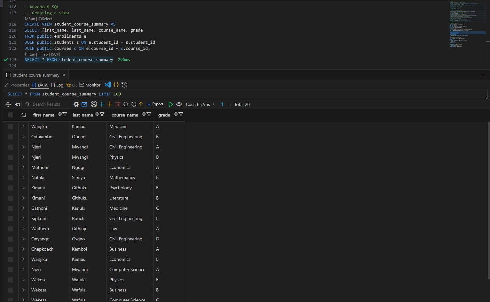

# Student Course Management System

## 📘 Project Overview
This project is a relational database system designed to manage students, instructors, courses, and enrollments. 
It demonstrates SQL proficiency through schema design, data population, complex queries, indexing, and view creation.

---
### 🧰 Pre-requisites
To work with this project, you’ll need the following tools installed and configured:
#### 1. PostgreSQL Database (Hosted or Local)

You must have access to a PostgreSQL database instance. You can choose one of the following options:

- **Cloud-based (Recommended)**: Use a Database-as-a-Service (DaaS) provider like [Aiven](https://aiven.io/).
- **Local Setup**: Install PostgreSQL manually

#### 2. Database Management Tool

You’ll need a tool to connect to and interact with the database. You can choose either of the following:

##### ✅ Option A: DBeaver (GUI Tool)
##### ✅ Option B: VS Code (IDE with SQL Support)
- Set it up for postgreSQL development by installing the extension and connecting to the database using instructions given [here](https://marketplace.visualstudio.com/items?itemName=cweijan.vscode-postgresql-client2)

## 🗃️ Database Schema Explained

### Tables
- **Students**: Stores basic information about each student.
- **Instructors**: Stores information about instructors.
- **Courses**: Each course is taught by an instructor.
- **Enrollments**: Links students and courses, with enrollment date and grade.

### ERD Diagram


### 📌 Key SQL Queries Explained

| Query | Description |
|:-----:|:-----:|
|Active Students | Find students enrolled in at least one course.
|Course Enrollment Stats | Show each course with number of enrolled students.
|No Enrollments | List students who haven't enrolled in any course.
|Student Averages | Compute each student’s average grade.
|Instructor Load | Count how many courses each instructor teaches.
|Top Performers | Top 3 students based on average grade.

### Sample output
#### The image shows the creation and output of a view


#### The image shows the creation and execution of a trigger 


## ▶️ How to Run

1. Clone the repository:
   ```bash
   git clone https://github.com/your-username/course-management-system.git

2. Open the project in VS Code or DBeaver and connect to the postgreSQL instance
3. Run the sql scripts

## 🚧 Challenges and Lessons Learned
 **Mastering SQL Fundamentals Pays**   
Deepened understanding of `JOINs`, `GROUP BY` and CTEs, which are crucial for writing clean and powerful queries.

**Importance of Planning the Schema**   
Visualizing entity relationships upfront makes the development process smoother.


